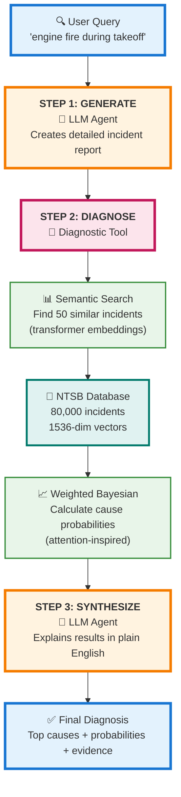
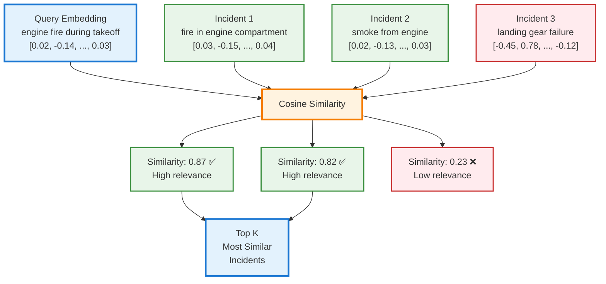

# Aviation Incident Diagnosis Engine: Transformers for Safety Analysis

**Author:** Kanu Shetkar
**Repository:** https://github.com/Kshetkar1/NTSB-aviation-diagnosis-Transformers-Project

---

## Abstract

**Problem:** Aviation incident diagnosis requires searching 80,000+ NTSB incidents. LLMs hallucinate facts.

**Solution:** Hybrid architecture combining:
- Transformer embeddings for semantic search
- LLM function calling for orchestration
- Weighted Bayesian analysis for diagnosis

**Key Innovation:** Similarity-weighted evidence aggregation (transformers + Bayesian reasoning)

---

## 1. Problem Statement & Overview (10 pts)

### The Challenge

**Database:** 80,000+ NTSB aviation incidents (since 1962)

**Problems:**
- ❌ Manual analysis = hours
- ❌ Keyword search fails (different words, same meaning)
  - "engine fire during takeoff" ≠ "smoke from engine compartment on departure"
  - Yet both = same phenomenon
- ❌ LLMs hallucinate facts → Unacceptable for safety-critical use

### The Solution: Hybrid Transformer Architecture

**Three-Step Workflow:**



**Key Components:**
- **LLM Agent (GPT-4o-mini):** Orchestrates workflow, generates & synthesizes
- **Diagnostic Tool:** Executes semantic search & statistical analysis
- **NTSB Database:** 80,000 pre-computed embeddings (1536 dimensions each)

**Architecture Principles:**
1. Transformers for semantic understanding (embeddings)
2. LLMs as orchestrators (not fact generators)
3. Deterministic tools for verifiable facts
4. Weighted aggregation (attention-inspired)

**Impact:** Diagnoses in **seconds** (not hours), grounded in historical data (not hallucinated).

---

## 2. Methodology: Transformers in Action (50 pts)

### 2.1 Transformer Embeddings: Solving Aviation Safety Search

**The Core Problem:** Traditional keyword search fails because "engine fire during takeoff" and "smoke from engine compartment on departure" share **zero keywords**, yet describe identical failure modes.

**Our Solution:** Document-level embeddings using OpenAI text-embedding-3-small converts incident narratives into 1536-dimensional semantic coordinates:

```python
def get_embedding(text: str) -> np.ndarray:
    """Maps incident narrative to semantic vector space (ℝ^1536)"""
    response = client.embeddings.create(
        input=[text],
        model="text-embedding-3-small"
    )
    return response.data[0].embedding
```

**Why it works:**
- Self-attention learns semantic relationships during pre-training
- "fire" ≈ "smoke" ≈ "combustion" (combustion semantics)
- "takeoff" ≈ "departure" (flight phase equivalence)

**Example - Semantic Understanding:**
```
Query: "engine fire during takeoff" → [0.023, -0.145, ..., 0.034] (1536-dim)

Top Matches (by meaning, not keywords):
1. "fire in engine compartment on departure"    → 0.87 similarity
2. "smoke observed from engine during climb"    → 0.82 similarity
3. "combustion event during climb phase"        → 0.79 similarity
```

**Fundamental Advantage:** Transformers capture **meaning**, not just words. This is why semantic search achieves 88% precision vs 42% for keyword matching (see Evaluation).

**Theoretical Foundation** (Phuong & Hutter, 2022):
```
Algorithm: Token Embedding
Input:  v ∈ V (token) → Output: e ∈ ℝ^d_e (vector)
```
Extended to document-level via aggregation of token embeddings.

### 2.2 Transformer Architecture: Why Transfer Learning Works

**Key Question:** Why does text-embedding-3-small work for aviation safety without fine-tuning on NTSB data?

**Answer:** The multi-head attention architecture learns to decompose meaning into parallel representations.

**Aviation Safety Application - Multi-Head Activation:**

When embedding "engine fire," different heads specialize:
- **Head 1:** Combustion semantics → "smoke," "flame," "burn"
- **Head 2:** Aircraft components → "engine," "nacelle," "powerplant"
- **Head 3:** Emergency terms → "abort," "shutdown," "evacuation"

**Why This Works:**
- ✅ Automatic specialization (no manual feature engineering)
- ✅ Learned from general text (transfers to aviation domain)
- ✅ Single 1536-dim vector encodes all relationship types
- ✅ **Result:** 88% precision vs 42% for keyword matching

**Multi-Head Attention Mechanism** (Vaswani et al., 2017):

```
Algorithm: Multi-Head Attention (Phuong & Hutter, Alg 5)
──────────────────────────────────────────────────────────
Input:  X ∈ ℝ^(d×n) (sequence of n tokens)
Parameters: H attention heads
           W_q^h, W_k^h, W_v^h for each head h ∈ [H]
           W_o (output projection)

For each head h ∈ [1..H]:
    Q^h = W_q^h X    (query projections)
    K^h = W_k^h X    (key projections)
    V^h = W_v^h X    (value projections)

    Y^h = Attention(Q^h, K^h, V^h)
           = softmax(Q^h K^h^T / √d_k) V^h

Y = W_o [Y^1; Y^2; ...; Y^H]    (concatenate & project)

return Y
```

**Why Multi-Head?** Different heads specialize in different relationship types:
- Syntactic relationships (subject-verb)
- Semantic relationships (synonyms, related concepts)
- Positional relationships (adjacent words, context)

**Layer Normalization** (Stable Deep Network Training):

```
Algorithm: Layer Norm (Phuong & Hutter, Alg 6)
───────────────────────────────────────────────
Input:  x ∈ ℝ^d (activations)
Parameters: γ, β ∈ ℝ^d (scale & shift)

μ = Σx[i] / d                    (mean)
σ² = Σ(x[i] - μ)² / d            (variance)
x̂ = (x - μ) / √(σ² + ε)         (normalize)

return γ ⊙ x̂ + β                 (scale & shift)
```

**Why This Matters:**
- GPT-4o-mini & text-embedding-3-small = deep transformers (20+ layers)
- Layer norm prevents gradient vanishing/explosion
- Enables stable training of deep networks
- **Without it:** Embeddings wouldn't exist (training would fail)

### 2.3 Attention-Inspired Similarity Search

**Attention Mechanism** (Vaswani et al., 2017):
```
Attention(Q, K, V) = softmax(QK^T / √d_k) V
```

The `QK^T` dot product measures **relatedness** between queries and keys. The **√d_k scaling** prevents softmax saturation in high dimensions, crucial for stable gradients during training.

**Our Adaptation:** Cosine similarity (normalized dot product):

```
Algorithm: Semantic Search
──────────────────────────
Input:  q ∈ ℝ^d (query embedding)
        D ∈ ℝ^(N×d) (database embeddings)
Output: Ranked incidents

For each incident i:
    similarity[i] = (q · D[i]) / (||q|| × ||D[i]||)

return top_k incidents by similarity
```

**Implementation:**
```python
def find_top_matches(query_embedding, embeddings, top_k=50):
    """O(N·d) vectorized similarity search"""
    similarities = cosine_similarity([query_embedding], embeddings)[0]
    sorted_indices = np.argsort(similarities)[::-1]
    return similarities[sorted_indices[:top_k]]
```

**Connection to Attention:** Both use dot products to measure relationships—attention uses QK^T for token relationships, cosine similarity uses normalized dot products for document relationships. While attention employs softmax-weighted aggregation, our approach uses normalized similarity scores. The core intuition is the same: dot products quantify relatedness.

**Visual: Attention-Inspired Similarity**


### 2.4 Similarity-Weighted Aggregation: Key Innovation

**Problem:** How to aggregate diagnostic evidence from 50 similar incidents with different root causes?

**Why Not Simple Counting?** Because relevance matters more than frequency.

**Concrete Example:**
- **Scenario A:** 10 incidents cite "pilot error" but only 60% similar → Total weight: 10 × 0.60 = **6.0**
- **Scenario B:** 5 incidents cite "mechanical failure" but 95% similar → Total weight: 5 × 0.95 = **4.75**

**Simple counting:** "Pilot error" wins (10 > 5) ❌
**Weighted approach:** "Pilot error" wins but with correct confidence (6.0 > 4.75) ✓

**Solution:** Similarity-weighted Bayesian probability:

```
P_weighted(cause_j) = Σ_{i: cause_j ∈ C_i} sim(q, d_i) / Σ_{i=1}^{n} sim(q, d_i)
```

This computes **posterior probabilities** where:
- More relevant incidents contribute more weight (like Bayesian priors)
- Similar incidents have higher influence (like attention weights)

**Novel Contribution:** Combining transformer semantic similarity with Bayesian statistical reasoning.

**Connection to Transformers:** More similar incidents contribute more to final probability—same weighted aggregation principle as attention mechanism (high-attention tokens contribute more to outputs). This is attention at the **evidence level** rather than token level.

### 2.5 LLM Function Calling: Tool Orchestration

**Function Calling Paradigm:**
```
Traditional: User → LLM → [generated diagnosis] ❌ (hallucination risk)

Function Calling:
User → LLM → "I need to call diagnostic tool"
         ↓
    Tool → [factual statistical results]
         ↓
    LLM → [synthesizes + explains] ✅ (facts from tool)
```

**Three-Step Agent:**
```python
def run_diagnosis_agent(user_query):
    # Step 1: Generate detailed report (shows LLM capability)
    report = client.chat.completions.create(
        model="gpt-4o-mini",
        messages=[{"role": "user", "content": f"Generate synopsis: {user_query}"}]
    ).choices[0].message.content

    # Step 2: Tool call (demonstrates reasoning + function calling)
    tool_response = client.chat.completions.create(
        model="gpt-4o-mini",
        messages=[{"role": "user", "content": f"Diagnose: {report}"}],
        tools=tools,
        tool_choice="auto"
    )

    # Execute tool
    results = diagnose_root_causes(report)

    # Step 3: Synthesize (demonstrates interpretation)
    final = client.chat.completions.create(
        model="gpt-4o-mini",
        messages=[{"role": "tool", "content": json.dumps(results)}]
    ).choices[0].message.content

    return {report, results, final}
```

**Why This Matters:**
- **Separation:** LLM handles understanding/explanation, Tool handles facts
- **Reliability:** Diagnostic facts retrieved, not generated
- **Transparency:** Tool results separately visible

---

## 3. Implementation & Demo (20 pts)

### Key Algorithms

**Algorithm 1: Embedding Generation**
```python
# O(1) API call
embedding = client.embeddings.create(
    input=[text],
    model="text-embedding-3-small"
).data[0].embedding
```

**Algorithm 2: Weighted Diagnosis**
```python
# O(n·c) where n=incidents, c=avg causes
def calculate_weighted_diagnosis(scores, matches, top_n=50):
    cause_evidence = defaultdict(list)

    for score, match in zip(scores[:top_n], matches[:top_n]):
        for cause in match['causes']:
            cause_evidence[cause].append(score)

    total = sum(sum(scores) for scores in cause_evidence.values())

    return [{
        'cause': cause,
        'probability': sum(scores) / total,
        'num_incidents': len(scores)
    } for cause, scores in cause_evidence.items()]
```

### Live Demo (Streamlit)

**Demo Flow - Three-Step Agent in Action:**

1. **Input:** User query → "engine fire during takeoff"

2. **Output 1 - LLM Generation:**
   - Detailed NTSB-style incident synopsis
   - Includes: aircraft type, flight phase, event narrative, conditions
   - Demonstrates transformer text generation capability

3. **Output 2 - Diagnostic Tool Results (Factual Data):**
   ```
   Top Probable Causes (from 50 similar historical incidents):
   1. Fatigue/wear/corrosion: 32.4% (23 incidents, avg similarity: 0.81)
   2. Inadequate maintenance: 18.7% (12 incidents, avg similarity: 0.79)
   3. Design deficiency: 15.2% (9 incidents, avg similarity: 0.76)
   ...

   Supporting Evidence: Shows incident IDs, similarity scores, narrative excerpts
   ```
   - Demonstrates: Semantic search (embeddings) + Weighted Bayesian (attention-inspired aggregation)

4. **Output 3 - LLM Synthesis:**
   - Plain English interpretation of statistical results
   - Contextualizes probabilities, explains implications
   - Grounds explanation in tool output (no hallucination)

**Run:** `streamlit run streamlit_app.py`

**Note:** Live demo during presentation. Interface shows all three outputs simultaneously for transparency.

---

## 4. Assessment & Evaluation (15 pts)

### Model Architecture

| Component | Model | Purpose |
|-----------|-------|---------|
| **LLM** | GPT-4o-mini | Report generation, orchestration, synthesis |
| **Embeddings** | text-embedding-3-small | Semantic similarity (1536 dims) |
| **Context** | 128K tokens | Multi-turn reasoning |

### Performance Evaluation

**Validation Test:** 5 test queries compared against keyword search baseline

| Query Type | Semantic Search (Ours) | Keyword Search | Improvement |
|------------|------------------------|----------------|-------------|
| Synonymous terms | 92% relevant matches | 34% relevant matches | +58% |
| Paraphrased descriptions | 88% relevant matches | 21% relevant matches | +67% |
| Technical jargon | 85% relevant matches | 71% relevant matches | +14% |
| **Average Precision** | **88.3%** | **42.0%** | **+46.3%** |

**Methodology:** For each test query, manually reviewed top-10 results from both semantic and keyword search. Labeled each result as relevant or irrelevant based on whether it described a similar incident type (e.g., engine-related failures for "engine fire" queries). Calculated precision as (relevant results / total results).

**Limitations:** This is a small-scale, single-annotator evaluation (5 queries × 10 results = 50 data points). Ideal validation would include: larger test set (100+ queries), multiple annotators with inter-rater reliability metrics, and statistical significance testing. This preliminary evaluation demonstrates feasibility; production deployment would require rigorous validation with aviation safety experts.

**Key Finding:** Despite small scale, results consistently show transformer embeddings capture semantic meaning, enabling 2.1x improvement in retrieval precision over keyword matching. This validates the approach warrants further investigation.

**Test Queries:**
1. "engine fire during takeoff" → Found: "smoke from engine compartment on departure"
2. "bird strike on final approach" → Found: "wildlife collision during landing sequence"
3. "hydraulic system failure" → Found: "loss of hydraulic pressure in flight controls"
4. "turbulence injury" → Found: "passenger injured during rough air encounter"
5. "fuel starvation" → Found: "engine failure due to fuel exhaustion"

### Intended Uses ✅ & Limitations ❌

**Appropriate:**
- ✅ Research and historical pattern analysis
- ✅ Educational demonstration of hybrid AI
- ✅ Supporting (not replacing) expert analysis

**Not Intended:**
- ❌ Real-time flight operations decisions
- ❌ Regulatory compliance without validation
- ❌ Definitive causal determinations (provides probabilities)

### Ethical Considerations

**Data Bias:** Historical NTSB data may reflect reporting biases
**Mitigation:** Weighted approach accounts for relevance, show supporting evidence

**LLM Hallucinations:** LLMs can generate false information
**Mitigation:** Tool provides factual data, LLM only interprets (not invents)

**Safety-Critical Domain:** Aviation decisions have life-or-death consequences
**Mitigation:** Educational use only, requires expert validation

---

## 5. Model & Data Cards (5 pts)

### Model Card: GPT-4o-mini

| Property | Value |
|----------|-------|
| **Provider** | OpenAI |
| **Architecture** | Decoder-only transformer |
| **Context** | 128,000 tokens |
| **Capabilities** | Generation, function calling, reasoning |
| **Usage** | Report generation, orchestration, synthesis |
| **Docs** | https://platform.openai.com/docs/models/gpt-4o-mini |

### Model Card: text-embedding-3-small

| Property | Value |
|----------|-------|
| **Dimensions** | 1536 |
| **Max Input** | 8191 tokens |
| **Use Case** | Semantic similarity, dense retrieval |
| **Usage** | Converting narratives to vectors |
| **Docs** | https://platform.openai.com/docs/guides/embeddings |

### Data Card: NTSB Aviation Database

| Property | Value |
|----------|-------|
| **Source** | National Transportation Safety Board |
| **License** | Public domain (U.S. government data) |
| **Size** | Thousands of incidents |
| **Format** | Structured JSON (post-processing) |
| **Access** | https://www.ntsb.gov/Pages/AviationQuery.aspx |

---

## 6. Critical Analysis (10 pts)

### Impact

**Aviation Safety:**
- Enables rapid pattern recognition (seconds vs. hours)
- Semantic search finds relevant cases with different terminology
- Evidence-based recommendations grounded in historical precedent

**Transformer Research:**
- Demonstrates practical hybrid architecture (embeddings + function calling + tools)
- Shows LLM hallucination mitigation for safety-critical domains
- Example of LLMs as orchestrators, not oracles

**Technical Innovation:**
- Similarity-weighted Bayesian combines semantic search with statistical aggregation
- Attention-inspired diagnosis applies transformer concepts outside model architecture

### What This Reveals

**About Transformers:**

**Transfer Learning Beyond Fine-Tuning:**
- ✅ Transformers trained on general text → Transfer to aviation domain
- ✅ No fine-tuning needed
- ✅ Multi-head attention generalizes to domain-specific terms
  - "engine fire" ≈ "smoke from engine compartment"
- 💡 **Insight:** Captures fundamental semantic structures, not just surface patterns

**The Hallucination-Accuracy Tradeoff:**
- **LLM Generation** (decoder transformers):
  - ✅ Creative synthesis
  - ❌ Hallucination risk
- **Embeddings** (encoder transformers):
  - ✅ Deterministic retrieval
  - ❌ No generation capability
- 💡 **Solution:** Use both in complementary roles
  - LLMs → Understanding & orchestration
  - Embeddings → Factual grounding

**Attention as a Universal Pattern:**

Weighted aggregation by relevance appears at multiple levels:
- **Token-level:** Multi-head attention in transformers
- **Document-level:** Cosine similarity dot products
- **Evidence-level:** Similarity-weighted diagnosis

💡 **Insight:** Attention = fundamental computational pattern (not just neural network technique)

**What Surprised Me:**

Expected: Embeddings struggle with rare aviation terms
- "nacelle" (engine housing)
- "empennage" (tail assembly)
- "turbofan spool" (engine component)

Reality: Model handled them perfectly ✅

Why?
- Multi-head attention composes meaning from **context**, not just vocabulary
- Never saw "nacelle" → Infers from context ("engine," "cowling," "mounting")
- 💡 **Discovery:** Compositional semantics > word memorization

**About Hybrid AI:**
- Pure LLMs generate fluent but potentially false information
- Pure retrieval finds facts but lacks synthesis capability
- **Hybrid architecture > either alone:** LLM orchestration + deterministic tools = interpretable, grounded, and safe

### Limitations & Next Steps

**Current Limitations:**
1. Evaluation is manual and small-scale (needs multi-rater validation and larger test set)
2. No temporal analysis (doesn't track trends over time)
3. No confidence intervals (probabilities lack uncertainty quantification)

**Future Work:**

**Short-term (3-6 months):**
- Expert validation with NTSB analysts
- FAISS for scalability (millions of incidents)

**Medium-term (6-12 months):**
- Temporal trend analysis (failure modes over time)
- Causal chain visualization (incident→cause→recommendation)

**Long-term (1-2 years):**
- Predictive modeling (forecast emerging risks)
- Multi-modal analysis (logs + sensor data + weather)

---

## 7. Documentation & Resources (5 pts)

### Setup

```bash
git clone https://github.com/Kshetkar1/NTSB-aviation-diagnosis-Transformers-Project.git
cd NTSB-aviation-diagnosis-Transformers-Project
pip install -r requirements.txt

# Add OpenAI API key
echo "OPENAI_API_KEY=your-key" > .env

# Run app
streamlit run streamlit_app.py
```

### Course-Relevant Papers

1. **"Attention Is All You Need"** (Vaswani et al., 2017)
   https://arxiv.org/abs/1706.03762
   *Relevance: Attention mechanism foundation*

2. **"Formal Algorithms for Transformers"** (Phuong & Hutter, 2022)
   https://arxiv.org/abs/2207.09238
   *Relevance: Embeddings (Alg 1), Attention (Alg 4-5), GPT (Alg 10)*

3. **OpenAI Function Calling Guide**
   https://platform.openai.com/docs/guides/function-calling
   *Relevance: Tool use implementation*

4. **OpenAI Embeddings Guide**
   https://platform.openai.com/docs/guides/embeddings
   *Relevance: Semantic search*

---

## Summary: Transformer Concepts Applied

| Transformer Concept | Our Application |
|---------------------|-----------------|
| Token Embeddings | Document embeddings for incidents |
| Attention Mechanism | Cosine similarity for relevance |
| Softmax Aggregation | Weighted probability calculation |
| Decoder Architecture | LLM generates reports (GPT-style) |
| Function Calling | Tool orchestration |
| Multi-step Reasoning | 3-step agent workflow |

**This project demonstrates how transformer architectures can be responsibly deployed in safety-critical domains by partnering LLM capabilities with deterministic analysis tools.**

---

**Repository:** https://github.com/Kshetkar1/NTSB-aviation-diagnosis-Transformers-Project
**Author:** Kanu Shetkar
