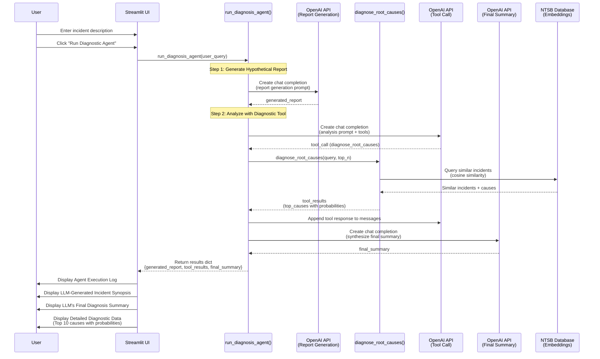

# Sequence Diagram: Streamlit App Flow

## Component Descriptions

- **User**: The end user interacting with the Streamlit web interface
- **Streamlit UI**: The Streamlit application (`streamlit_app.py`) handling UI rendering and user interactions
- **run_diagnosis_agent()**: The main agent function (`agent.py`) orchestrating the multi-step diagnosis process
- **OpenAI API (Report Generation)**: First LLM call to generate a hypothetical incident report
- **OpenAI API (Tool Call)**: Second LLM call that decides to use the diagnostic tool
- **OpenAI API (Final Summary)**: Third LLM call to synthesize the final diagnosis summary
- **diagnose_root_causes()**: The diagnostic tool function (`main_app.py`) that analyzes the incident
- **NTSB Database (Embeddings)**: The database of historical NTSB reports with pre-computed embeddings

## Flow Summary

1. User enters an incident description and clicks the button
2. Streamlit calls the agent function
3. **Step 1**: Agent generates a hypothetical incident report using OpenAI
4. **Step 2**: Agent calls OpenAI with tools, which triggers the diagnostic tool
5. The diagnostic tool queries the NTSB database for similar incidents
6. Tool returns structured results (top causes with probabilities)
7. **Step 3**: Agent synthesizes a final summary using OpenAI
8. Results are displayed in the Streamlit UI across multiple sections
